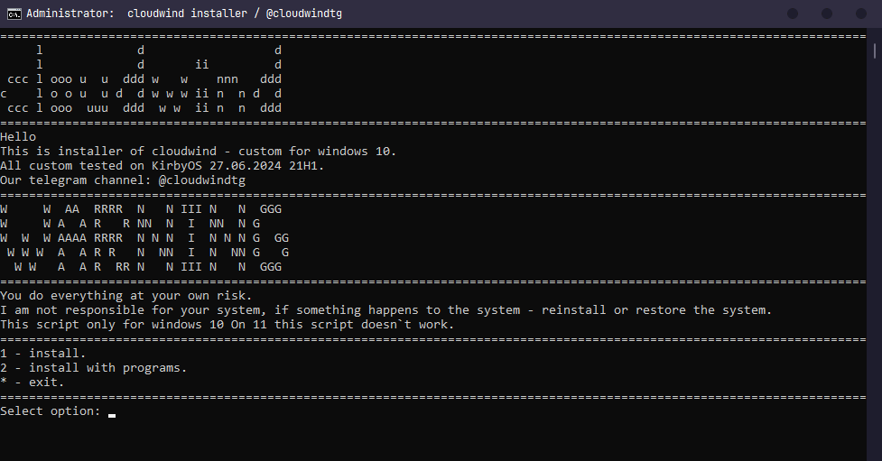
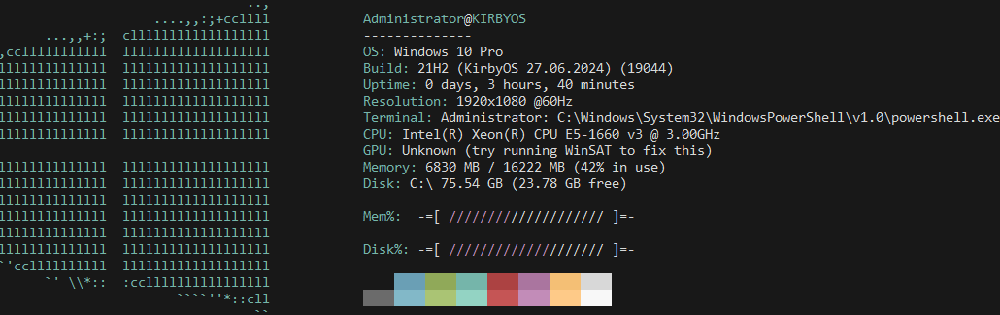

<h1 align="center">Hello windows, i`m cloudwind.</h1>



## WARNING!
You do everything at your own risk. 
I am not responsible for your system, if something happens to the system - reinstall or restore the system.
This script only for windows 10! On Windows 11 this script doesn`t work.

## How to install a cloudwind?
```
1. Install a git on windows (https://github.com/git-for-windows/git/releases/download/v2.45.2.windows.1/Git-2.45.2-64-bit.exe)
2. Open a cmd.
3. In cmd, type "git clone https://github.com/W3dCIoud/cloudwind/ & cd cloudwind & "cloudwind setup.bat"
```

## Windows version supported:
```
Windows 10, 21H2
Windows 10, 22H2
```



1               | 2
---             | ---
OS              | [Windows 10, KirbyOS 21H1](discord.gg/KirbyCS)
Theme           | [Catppuccin](https://github.com/catppuccin/catppuccin)
Fonts           | [Jetbrains Mono Regular](https://www.jetbrains.com/lp/mono/)
Text redactor   | [N++](https://notepad-plus-plus.org/)
Videoplayer     | [VLC](https://www.videolan.org/)
Browser         | [Ungoogled Chromium](https://github.com/ungoogled-software/ungoogled-chromium)
